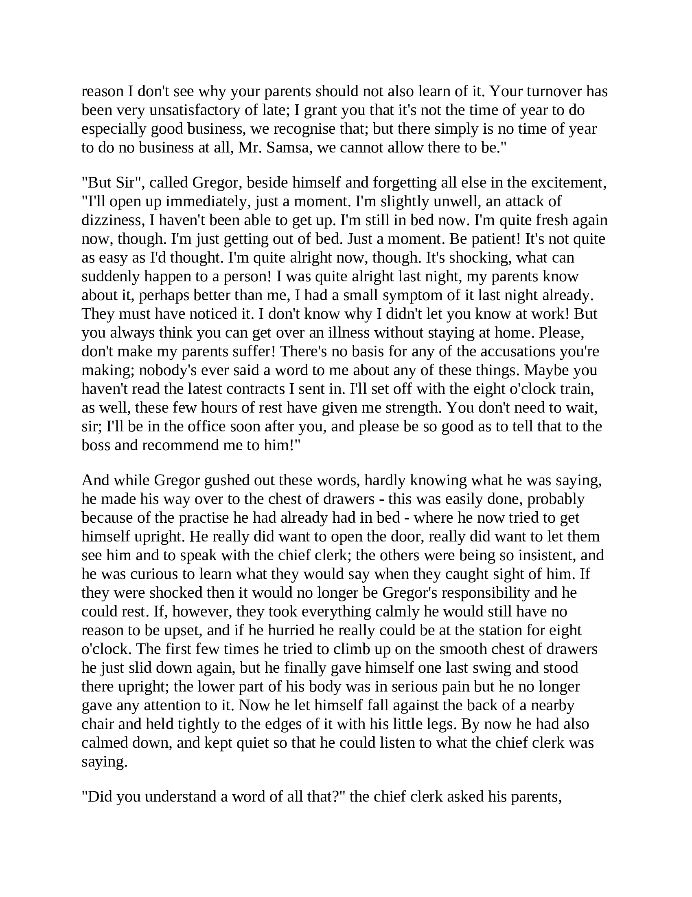
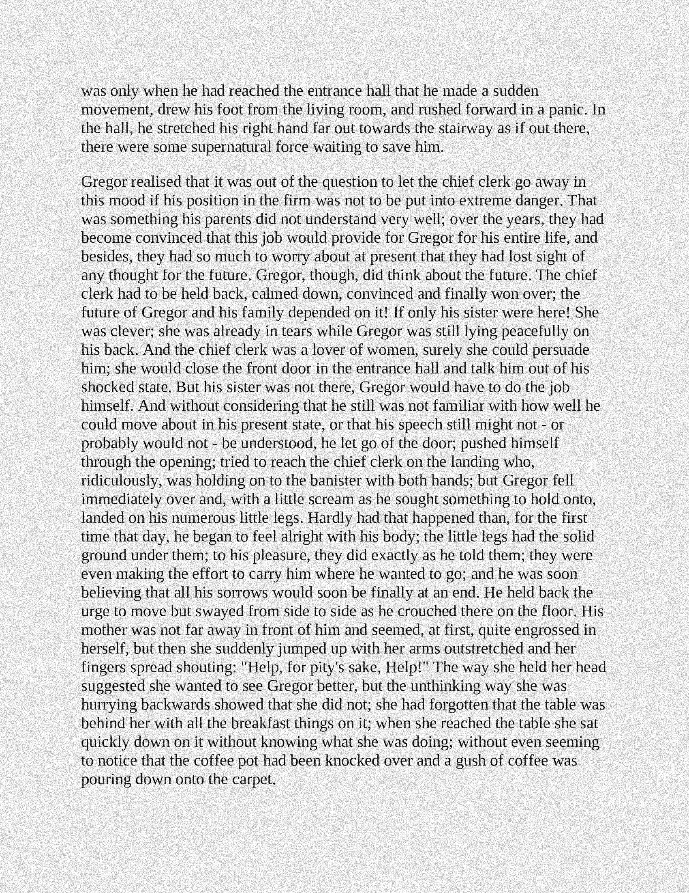
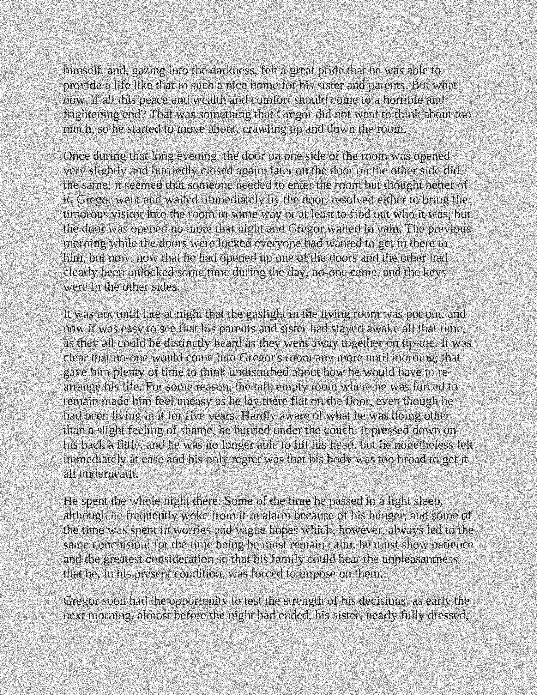
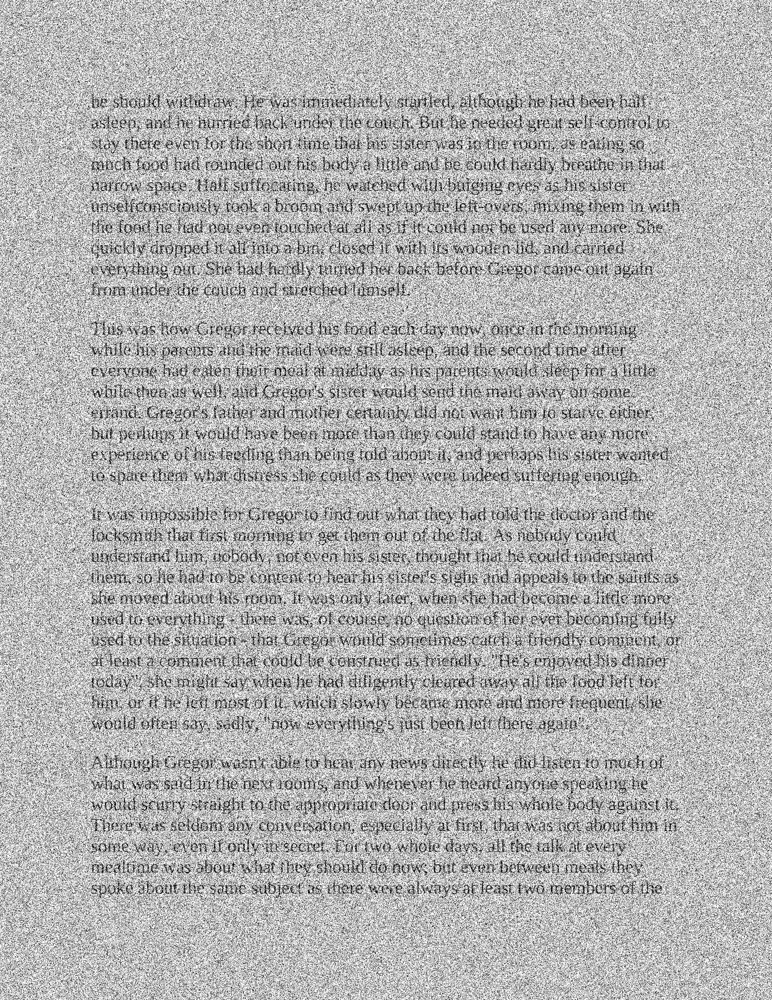
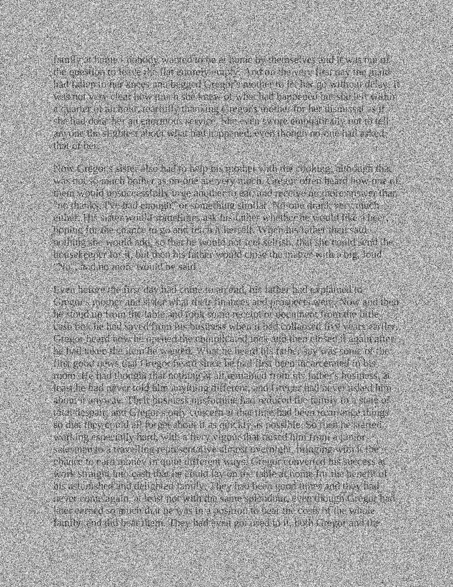
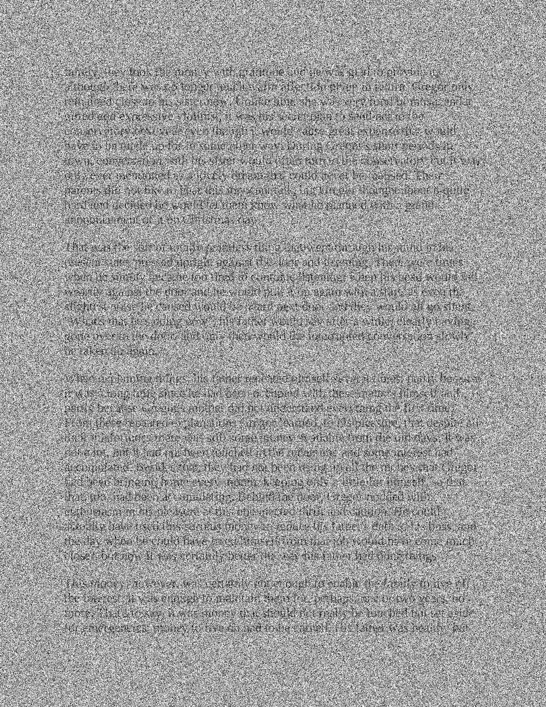

# Optical Character Recogniser - Assignment

## Description
This project is meant to demonstrate machine learning algorithms and techniques to implement an OCR with high accuracy by making use of learning techniques and feature reduction algorithms to make it more efficient.

## Scenario
Given some PDF pages to test and bounding boxes for letters, the system takes in the data in the training mode and computes what are the features that are more relevant to identifying characters and stores these features to then use on test pages.

## Features
- Implemented in python (External packages: numpy & scipy only)
- PCA (Principal component analysis) for reducing dimensions
- Feature selection based on divergences between classes
- A variant of K-Nearest neighbour (KNN) classifier
- Auto adjust value k in KNN based on noisy detection
- Error correction based on Dijkstra's algorithm

## To run
- Training stage:   `python3 code/train.py`
- Evaluation stage: `python3 code/evaluate.py dev`

## Proformance (Average: 80.80637% Accuracy)
97.7% Accuracy 
-------------
98.4% Accuracy 
-------------
92.5% Accuracy 
-------------
77.7% Accuracy 
-------------
65.5% Accuracy 
-------------
53.1% Accuracy 
-------------

## Notes
- | -
--- | ---
Time used (for 6 pages in evaluation stage) | 47.48732304573059 s
Python | Python 3.8.0 x64
Platform | Microsoft Windows 10 Pro (Version 10.0.18362 Build 18362) x64
Processor |	AMD Ryzen 7 3800X 8-Core Processor, 3893 Mhz, 8 Core(s), 16 Logical Processor(s)
RAM | 16.9 GB (2x 8 GB 2666 MHz)
